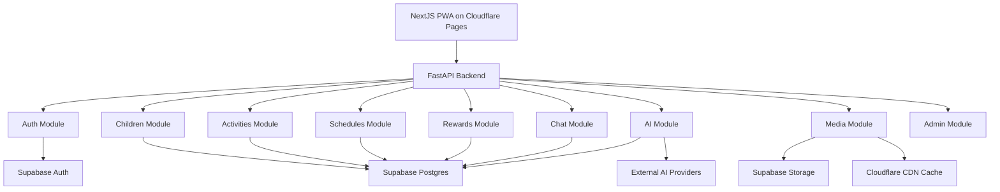

# Backend Module Links

## Muc tieu

File nay mo ta cach cac module backend lien ket voi nhau de AI coder khac co the tiep tuc code ma khong phai suy luan lai kien truc.

## So do module



## Module ownership

### auth

- Validate Supabase JWT.
- Lay user/family scope.
- Cung cap dependency `current_user`.

### children

- CRUD ho so be.
- Check family ownership.
- Tra child profile cho AI context.

### activities

- CRUD activity library.
- Filter theo tuoi/chu de/thoi luong.
- Quan ly draft/published/archived.

### schedules

- CRUD schedule va schedule_items.
- Mark complete/skip.
- Goi rewards khi complete.
- Goi activity_history khi complete/skip.

### rewards

- Cong xu/XP.
- Gan badge.
- Tra summary cho trang chu cua be.

### ai

- Quan ly provider registry.
- Build AI context.
- Goi provider adapter.
- Validate JSON output khi tao lich/hoat dong.

### chat

- Luu chat_history.
- Goi AI module.
- Rut gon context gan day.

### media

- Tao signed upload URL.
- Luu media_assets.
- Gan asset vao avatar/activity/theme.

### admin

- Gom cac endpoint quan ly: provider, activity draft, storage, system settings.

## Dependency flow

- `schedules` phu thuoc `activities`, `children`, `rewards`.
- `ai` phu thuoc `children`, `schedules`, `activities`, `chat`, `rewards`.
- `chat` phu thuoc `ai`.
- `media` doc/ghi Supabase Storage va `media_assets`.
- `admin` dung lai service cua module khac, khong lap logic rieng.

## Thu muc backend de tao o cheng 2

```text
backend/
  app/
    main.py
    core/
      config.py
      security.py
      database.py
    modules/
      auth/
      children/
      activities/
      schedules/
      rewards/
      ai/
      chat/
      media/
      admin/
    schemas/
    tests/
  pyproject.toml
  Dockerfile
  .env.example
```

## Trang thai implementation hien tai

Da tao skeleton backend tai `backend/`:

- `app/main.py`: FastAPI app, CORS, `GET /health`, include route modules.
- `app/core/config.py`: env loader, CORS parsing, Supabase/provider env names.
- `app/core/database.py`: lazy Supabase service-role client.
- `app/core/security.py`: bearer auth dependency placeholder cho Supabase JWT.
- `app/modules/children/router.py`: `GET /children`, `POST /children`, `GET /children/{child_id}` skeleton.
- `app/modules/activities/router.py`: `GET /activities`, `POST /activities` skeleton.
- `app/modules/schedules/router.py`: `GET /schedules/current`, `POST /schedules`, `PATCH /schedule-items/{item_id}` skeleton.
- `app/modules/ai/providers.py`: `AIProviderAdapter`, `OpenAICompatibleAdapter`, default provider env mapping.
- `app/modules/ai/router.py`: provider list/create/test va generate schedule skeleton.
- `app/modules/chat/router.py`: `POST /ai/chat` skeleton.
- `app/modules/media/router.py`: `POST /media/sign-upload` skeleton.
- `app/modules/rewards/service.py`: reward service placeholder.
- `tests/test_smoke.py`: smoke tests cho health va provider list.

Route skeleton co the tra `501 Not Implemented` cho logic chua noi database/provider that. `GET /health` va `GET /api/v1/ai/providers` chay duoc de smoke test.
