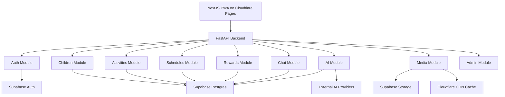

# Backend Module Links

## Muc tieu

File nay mo ta cach cac module backend lien ket voi nhau de AI coder khac co the tiep tuc code ma khong phai suy luan lai kien truc.

## So do module



## Module ownership

### auth

- Validate Supabase JWT.
- Lay user/family scope.
- Cung cap dependency `current_user`.

### children

- CRUD ho so be.
- Check family ownership.
- Tra child profile cho AI context.

### activities

- CRUD activity library.
- Filter theo tuoi/chu de/thoi luong.
- Quan ly draft/published/archived.

### schedules

- CRUD schedule va schedule_items.
- Mark complete/skip.
- Goi rewards khi complete.
- Goi activity_history khi complete/skip.

### rewards

- Cong xu/XP.
- Gan badge.
- Tra summary cho trang chu cua be.

### ai

- Quan ly provider registry.
- Build AI context.
- Goi provider adapter.
- Validate JSON output khi tao lich/hoat dong.

### chat

- Luu chat_history.
- Goi AI module.
- Rut gon context gan day.

### media

- Tao signed upload URL.
- Luu media_assets.
- Gan asset vao avatar/activity/theme.

### admin

- Gom cac endpoint quan ly: provider, activity draft, storage, system settings.

## Dependency flow

- `schedules` phu thuoc `activities`, `children`, `rewards`.
- `ai` phu thuoc `children`, `schedules`, `activities`, `chat`, `rewards`.
- `chat` phu thuoc `ai`.
- `media` doc/ghi Supabase Storage va `media_assets`.
- `admin` dung lai service cua module khac, khong lap logic rieng.

## Thu muc backend de tao o cheng 2

```text
backend/
  app/
    main.py
    core/
      config.py
      security.py
      database.py
    modules/
      auth/
      children/
      activities/
      schedules/
      rewards/
      ai/
      chat/
      media/
      admin/
    schemas/
    tests/
  pyproject.toml
  Dockerfile
  .env.example
```

## Trang thai implementation hien tai (Updated 2026-06-03)

Backend MVP da hoan thien voi day du repository, service, auth, AI integration, middleware, va dev mode fallback.

### Core modules (hoat dong)

- `app/main.py`: FastAPI app, CORS, `GET /health`, include route modules, exception handlers.
- `app/core/config.py`: env loader, CORS parsing, Supabase/provider env names.
- `app/core/database.py`: lazy Supabase service-role client. Raise `DatabaseNotConfiguredError` khi thieu env.
- `app/core/security.py`: JWT validation (`python-jose`), `get_current_user`. Dev mode: bypass signature verification khi thieu `SUPABASE_JWT_SECRET`.
- `app/core/dependencies.py`: `get_current_family`. Dev mode: tra ve `DEMO_FAMILY` khi DB offline.
- `app/core/middleware.py`: `RequestLoggingMiddleware` (logger `app.access`), `RateLimitMiddleware` (60 req/min).
- `app/core/exceptions.py`: Centralized exception handlers.

### Repository layer

- `app/repositories/base.py`: `BaseRepository` voi soft-delete, lazy client, in-memory demo data khi DB offline (`_is_demo()`), query builder (`_base_query`, filter, order, limit).
- `app/repositories/children.py`: `ChildrenRepository` — demo data: 2 children (Bong 7 tuoi, Bin 8 tuoi).
- `app/repositories/activities.py`: `ActivitiesRepository` — demo data: 3 activities (Ve tranh, Doc truyen, Trong cay).
- `app/repositories/schedules.py`: `SchedulesRepository` + `ScheduleItemsRepository` — demo data: 1 schedule + 3 items.

### Service layer

- `app/services/children.py`: `ChildrenService` — auto-create rewards record khi them be.
- `app/services/activities.py`: `ActivitiesService` — auto-generate slug (normalize tieng Viet).
- `app/services/schedules.py`: `SchedulesService` — create schedule with items, get current schedule.

### Module routers (day du CRUD + auth + dev mode)

- `app/modules/children/router.py`: `GET /children`, `POST /children`, `GET /children/{id}`, `GET /children/{id}/stats` (co dev mode fallback).
- `app/modules/activities/router.py`: `GET /activities`, `POST /activities`, `GET /activities/{id}`.
- `app/modules/schedules/router.py`: `GET /schedules` (list), `GET /schedules/current`, `POST /schedules`, `POST /schedules/{id}/items`, `PATCH /schedule-items/{id}`.
- `app/modules/ai/router.py`: `GET /ai/providers`, `POST /ai/providers/{id}/test`, `POST /ai/chat` (co fallback rule-based), `POST /ai/generate-schedule` (co fallback schedule), `POST /ai/generate-image` (Pollinations fallback).
- `app/modules/ai/context.py`: `AIContextBuilder` — lay child context tu DB hoac demo data.
- `app/modules/ai/providers.py`: `OpenAICompatibleAdapter`, `GeminiAdapter`, retry 3 lan, timeout 30s.
- `app/modules/rewards/router.py`: `POST /rewards/complete-activity` (co dev mode fallback).
- `app/modules/chat/router.py`: `POST /chat` — module rieng biet (frontend hien dung `/ai/chat`).
- `app/modules/media/router.py`: `POST /media/sign-upload`, `POST /media/confirm-upload`, `GET /media/assets`.

### Testing

- `tests/conftest.py`: Fixtures mock auth + supabase.
- `tests/test_services.py`: 7 unit tests.
- `tests/test_routers.py`: 8 integration tests.
- `tests/test_smoke.py`: Smoke tests.
- **Ket qua: pytest 17 passed.**

### Dev mode contract

Khi `SUPABASE_URL` hoac `SUPABASE_SERVICE_ROLE_KEY` khong co:
- Tat ca repository tra ve demo data thay vi crash.
- Tat ca router co `dev_mode: true` trong response khi khong the ghi DB.
- Auth van hoat dong voi fake Bearer token (frontend dung `"fake"` hoac bat ky token nao).
