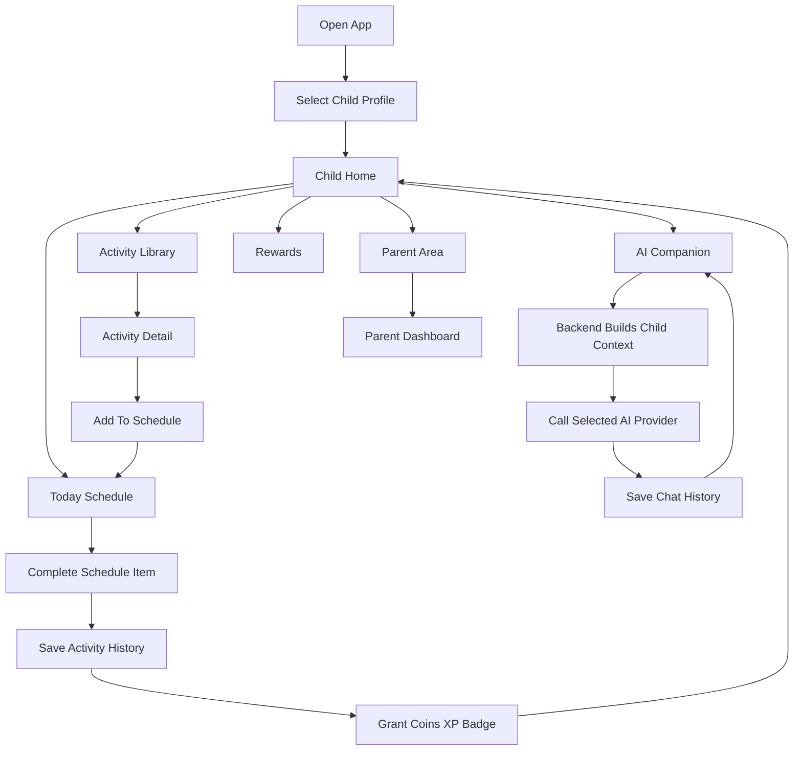
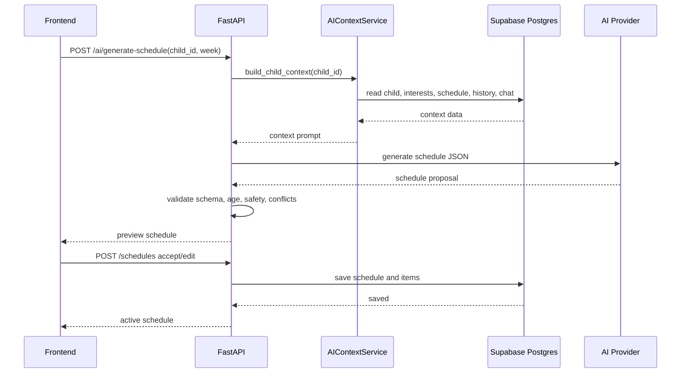
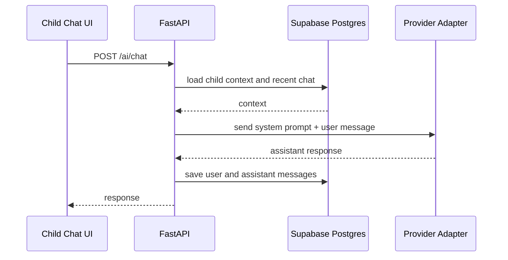
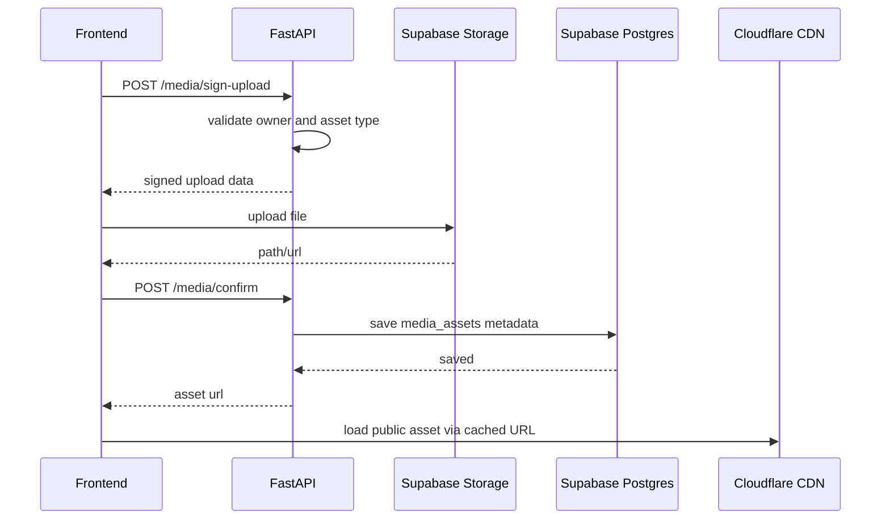
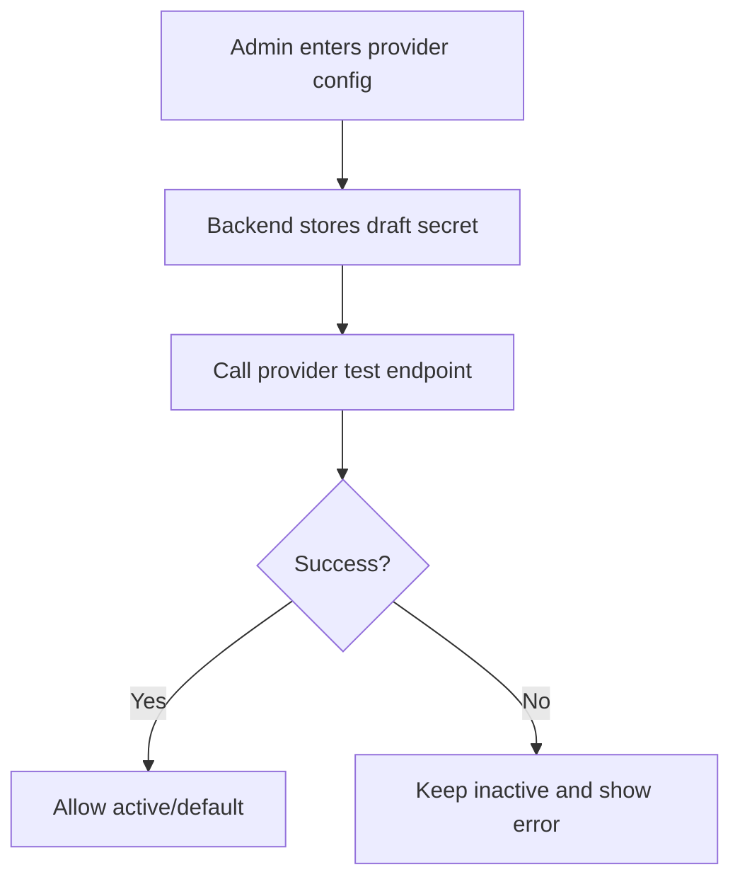

# App Flow Graph

## Flow tong the

```mermaid
flowchart TD
  Start["Open App"] --> SelectChild["Select Child Profile"]
  SelectChild --> ChildHome["Child Home"]
  ChildHome --> TodaySchedule["Today Schedule"]
  ChildHome --> ActivityLibrary["Activity Library"]
  ChildHome --> AIFriend["AI Companion"]
  ChildHome --> Rewards["Rewards"]
  ChildHome --> ParentGate["Parent Area"]

  TodaySchedule --> CompleteItem["Complete Schedule Item"]
  CompleteItem --> SaveHistory["Save Activity History"]
  SaveHistory --> GrantReward["Grant Coins XP Badge"]
  GrantReward --> ChildHome

  ActivityLibrary --> ActivityDetail["Activity Detail"]
  ActivityDetail --> AddToSchedule["Add To Schedule"]
  AddToSchedule --> TodaySchedule

  AIFriend --> BuildContext["Backend Builds Child Context"]
  BuildContext --> CallProvider["Call Selected AI Provider"]
  CallProvider --> SaveChat["Save Chat History"]
  SaveChat --> AIFriend

  ParentGate --> ParentDashboard["Parent Dashboard"]
```

## Flow tao lich bang AI

```mermaid
sequenceDiagram
  participant UI as Frontend
  participant API as FastAPI
  participant C as AIContextService
  participant DB as Supabase Postgres
  participant AI as AI Provider

  UI->>API: POST /ai/generate-schedule(child_id, week)
  API->>C: build_child_context(child_id)
  C->>DB: read child, interests, schedule, history, chat
  DB-->>C: context data
  C-->>API: context prompt
  API->>AI: generate schedule JSON
  AI-->>API: schedule proposal
  API->>API: validate schema, age, safety, conflicts
  API-->>UI: preview schedule
  UI->>API: POST /schedules accept/edit
  API->>DB: save schedule and items
  DB-->>API: saved
  API-->>UI: active schedule
```

## Flow chat AI

```mermaid
sequenceDiagram
  participant UI as Child Chat UI
  participant API as FastAPI
  participant DB as Supabase Postgres
  participant AI as Provider Adapter

  UI->>API: POST /ai/chat
  API->>DB: load child context and recent chat
  DB-->>API: context
  API->>AI: send system prompt + user message
  AI-->>API: assistant response
  API->>DB: save user and assistant messages
  API-->>UI: response
```

## Flow upload anh

```mermaid
sequenceDiagram
  participant UI as Frontend
  participant API as FastAPI
  participant Storage as Supabase Storage
  participant DB as Supabase Postgres
  participant CF as Cloudflare CDN

  UI->>API: POST /media/sign-upload
  API->>API: validate owner and asset type
  API-->>UI: signed upload data
  UI->>Storage: upload file
  Storage-->>UI: path/url
  UI->>API: POST /media/confirm
  API->>DB: save media_assets metadata
  DB-->>API: saved
  API-->>UI: asset url
  UI->>CF: load public asset via cached URL
```

## Flow provider test

```mermaid
flowchart TD
  Admin["Admin enters provider config"] --> SaveDraft["Backend stores draft secret"]
  SaveDraft --> Test["Call provider test endpoint"]
  Test --> Success{"Success?"}
  Success -->|Yes| Activate["Allow active/default"]
  Success -->|No| Reject["Keep inactive and show error"]
```

